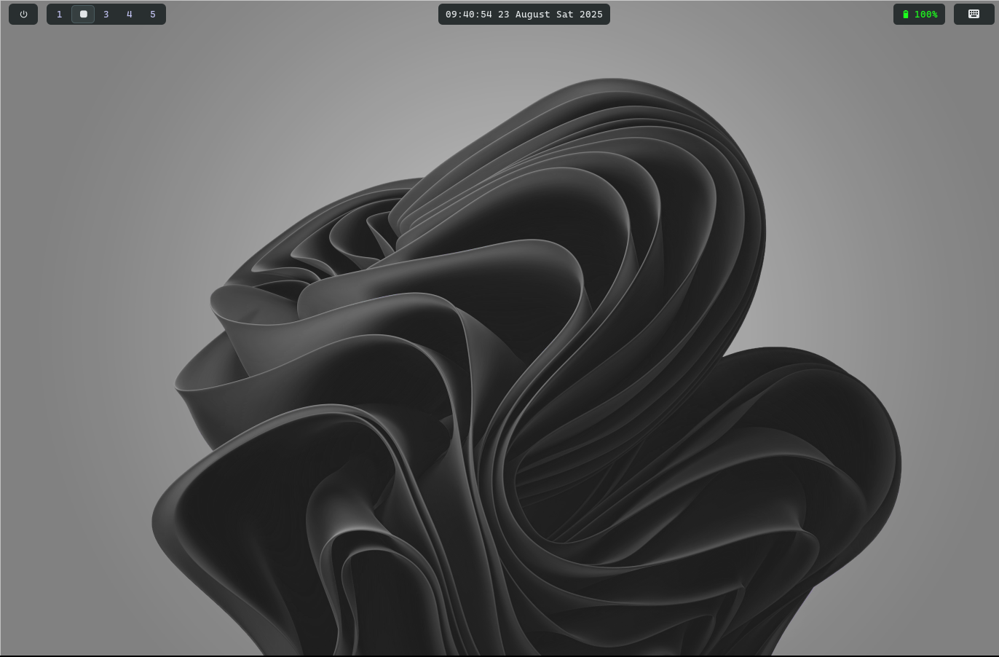

Todo:
- [] this repo root needs to be ~/config/
- [] Move all default omarchy config to this repo
- [] use zsh or see other alternatives
- [] config ghostty
- [] config nemo
- [X] auto center and resize on toggle float
- [] Write a setup script to install everything and override some files
- [] Find a emoji popover like Windows' (smile?, efck?)
- [X] Change window border
- [] config plymouth
- [] customize lockscreen
- [] remove that shit omarchy enormous logo
- [] config boot loader and add windows
- [] customize the file manager
- [] default workspace for spotify
- [] remove control + ; behavior
- [] binding to launch web bitwarden
- [] make binding pause workww
- [] add x icon to notification or a timeout
- [] customize walker
- [X] copy history
- [] make discord floating
- [] turn off headset lights. run on launch
- Change keybindings
    - [] whatsapp
    - [] discord
    - [X] code
    - [X] spotify
    - [X] files (nemo)
  - [X] config swayosd https://github.com/ErikReider/SwayOSD
  - 